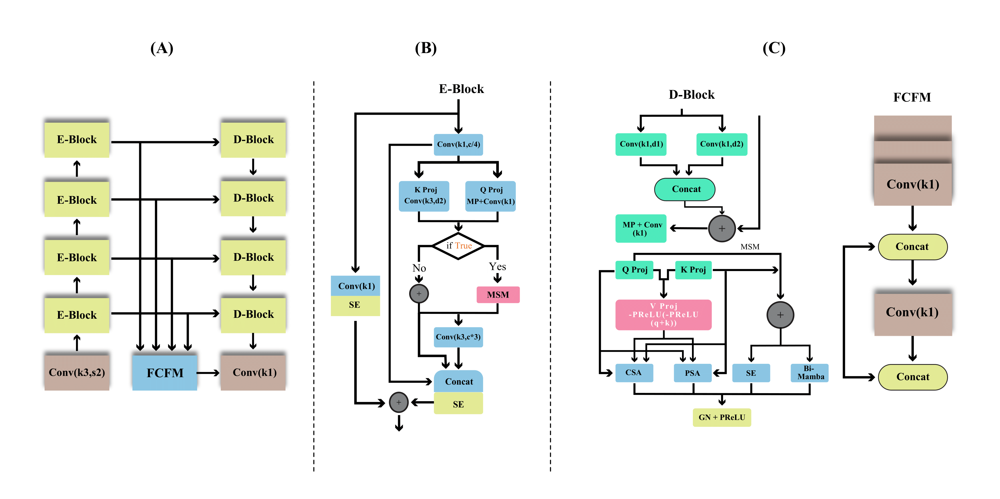

# UCA-MNet: An Ultra-Lightweight Cross-Scale Attention Mamba Network for Accurate Skin Lesion Segmentation

## Overview

UCA-MNet (Cross-scale Attention Mamba Network) is an ultra-lightweight encoder-decoder network for skin lesion segmentation that integrates convolutional multi-scale attention with Bidirectional Mamba for linear-complexity long-range dependency modelling — all within **0.33M Parameters | 4.30 GFLOPs | 0.0537s Inference Time**. UCA-MNet achieves the best F1-score and mIoU on ISIC-2018 among all evaluated models, including architectures with 83× more parameters (VM-UNet, 27.43M), while remaining the most parameter-efficient model in the comparison.

## Architecture



UCA-MNet follows a U-shaped encoder-decoder design with three primary components: a hierarchical encoder of four Encoder Blocks (E-Blocks), a multi-scale fusion decoder of four Decoder Blocks (D-Blocks), and a Feature Compression and Fusion Module (FCFM) that aggregates all decoder outputs into the final segmentation map.

```
Input (320×320×3)
    ↓  Initial Conv (stride 2) → C channels [160×160]
    ↓
    E-Block 1: dual-path (Q/K + expansion conv) + SE×2   [C,   80×80 ]
    E-Block 2: dual-path + MSM + SE×2                    [2C,  40×40 ]
    E-Block 3: dual-path + MSM + SE×2                    [4C,  20×20 ]
    E-Block 4: dual-path + MSM + SE×2                    [8C,  10×10 ]
    ↓  (skip connections to each D-Block)
    D-Block 4: dilated skip enhancement + MSM + Conv1×1  [8C,  10×10 ]
    D-Block 3: dilated skip enhancement + MSM + Conv1×1  [4C,  20×20 ]
    D-Block 2: dilated skip enhancement + MSM + Conv1×1  [2C,  40×40 ]
    D-Block 1: dilated skip enhancement + MSM + Conv1×1  [C,   80×80 ]
    ↓
    FCFM: upsample all D-Block outputs → concat → 1×1 convs → Conv1×1 → upsample → Output mask
```

The MSM is conditionally applied inside E-Blocks (activated when channel depth exceeds a threshold) and applied at every level in D-Blocks.

## Key Modules

**E-Block — Hierarchical Encoder Block**
Each E-Block processes input through two parallel paths and fuses them via Squeeze-and-Excitation (SE) attention:
- **Primary path**: 1×1 conv → Q/K projections (max-pool + 1×1 conv for Q; dilated 3×3 conv for K) → MSM (at deeper stages) or 1×1 conv (at shallowest stage)
- **Secondary path**: expansion 3×3 conv (expanding to 3× channels) — captures rich feature diversity
- Both paths are concatenated and refined by two successive SE blocks

MSM is gated on channel depth so computation is concentrated where multi-scale modelling provides the most benefit.

**MSM — Multi-Scale Module**
The core computational unit shared by encoder and decoder. Processes query/key projections sequentially through four sub-components in one pass:

1. **Value computation**: `V = −PReLU(−PReLU(Q + K))` — double-negated PReLU preserves both positive and negative responses
2. **Cross-Scale Attention (CSA)**: max-pool at 3×3 and 5×5, concatenate with V, fuse via 1×1 conv + BN + GELU + residual — captures inter-scale feature relationships across different spatial granularities
3. **Pyramidal Squeeze Attention (PSA)**: parallel pyramid of spatial attention maps at varying kernel sizes — weights features by spatial importance
4. **Squeeze-and-Excitation (SE)**: global average pooling → FC bottleneck → sigmoid recalibration — amplifies discriminative channels
5. **Bidirectional Mamba (Bi-Mamba)**: raster-scans the feature map as a 1D sequence in both forward and backward directions, modelling long-range spatial dependencies at O(N) complexity vs O(N²) for self-attention. At the third encoder level (20×20 tokens), Bi-Mamba requires 800 sequential steps vs 160,000 pairwise interactions for self-attention.

Output is stabilised by Group Normalisation + PReLU.

**D-Block — Multi-Scale Fusion Decoder Block**
Each D-Block fuses skip-connected encoder features with upsampled deeper decoder output. Skip features first pass through two parallel dilated convolutions (d=1, d=2) to expand receptive field before fusion. The fused representation is processed through the MSM via Q/K projections, followed by a 1×1 conv.

**FCFM — Feature Compression and Fusion Module**
Upsamples all four D-Block outputs to the shallowest decoder resolution, concatenates along the channel dimension, then compresses via a series of 1×1 convolutions to a single coherent feature map. A final 1×1 conv projects to one channel, upsampled to the original input resolution for the segmentation mask. Aggregating all four scales combines high-level semantics from deep D-Blocks with fine spatial detail from shallow D-Blocks.

## Loss Function

Composite loss combining pixel-level and region-based objectives with fixed equal weighting:

$$\mathcal{L}_\text{total} = \mathcal{L}_\text{BCE} + \mathcal{L}_\text{Dice} + \mathcal{L}_\text{IoU}$$

Unlike the annealing schedule used in prior chapters, α is fixed at 1.0 throughout training. Preliminary experiments showed UCA-MNet's compact architecture benefits from balanced region-level supervision at all training stages.

## Results

### ISIC-2017 and ISIC-2018

| Model | ISIC-2017 RC | ISIC-2017 PR | ISIC-2017 F1 | ISIC-2017 mIoU | ISIC-2018 RC | ISIC-2018 PR | ISIC-2018 F1 | ISIC-2018 mIoU | Params |
|-------|-------------|-------------|-------------|----------------|-------------|-------------|-------------|----------------|--------|
| H2Former | 0.8487 | 0.8582 | 0.8113 | 0.7984 | 0.9430 | 0.8290 | 0.8610 | 0.8207 | 33.70M |
| VM-UNet | **0.8641** | 0.8585 | **0.8500** | **0.8194** | 0.8844 | 0.8792 | 0.8659 | 0.8386 | 27.43M |
| VM-UNet-V2 | 0.7331 | 0.8646 | 0.7593 | 0.7645 | 0.7979 | 0.8405 | 0.7848 | 0.7631 | 23.16M |
| HED | 0.8027 | 0.8592 | 0.7781 | 0.7772 | 0.7956 | 0.9281 | 0.8155 | 0.8015 | 14.70M |
| EMCADNet-b0 | 0.8379 | 0.8620 | 0.8168 | 0.8081 | 0.9088 | 0.8652 | 0.8647 | 0.8314 | 3.92M |
| CMUNeXt | 0.8425 | 0.8629 | 0.8162 | 0.8034 | 0.8525 | 0.8860 | 0.8375 | 0.8134 | 3.15M |
| Rolling-UNet-S | 0.8562 | 0.8170 | 0.7874 | 0.7801 | 0.8689 | 0.8929 | 0.8508 | 0.8220 | 1.78M |
| UNeXt | 0.8323 | 0.8507 | 0.7932 | 0.7860 | 0.8723 | 0.8952 | 0.8563 | 0.8292 | 1.47M |
| ShuffleNetV2 | 0.8332 | 0.8519 | 0.8002 | 0.7899 | 0.8631 | 0.8982 | 0.8504 | 0.8256 | 1.38M |
| LightM-UNet | 0.7187 | 0.8318 | 0.7415 | 0.7490 | 0.8289 | 0.7987 | 0.7878 | 0.7628 | 1.15M |
| **UCA-MNet (ours)** | 0.8063 | **0.9204** | 0.8254 | 0.8180 | 0.8834 | **0.9211** | **0.8814** | **0.8515** | **0.33M** |

All baselines re-implemented from public source code and trained under the identical protocol.

### PH2

| Model | RC | PR | F1 | mIoU | Params |
|-------|----|----|----|----|--------|
| H2Former | 0.8885 | 0.9533 | 0.9144 | 0.8550 | 33.70M |
| VM-UNet | **0.9335** | 0.9233 | **0.9235** | 0.8712 | 27.43M |
| VM-UNet-V2 | 0.9105 | 0.9357 | 0.9182 | **0.8788** | 23.16M |
| HED | 0.9083 | 0.9233 | 0.9044 | 0.8524 | 14.71M |
| EMCADNet-b0 | 0.8216 | 0.6442 | 0.6396 | 0.5847 | 3.92M |
| CMUNeXt | 0.8912 | 0.9136 | 0.8873 | 0.8271 | 3.15M |
| Rolling-UNet-S | 0.9318 | 0.8930 | 0.9022 | 0.8383 | 1.78M |
| UNeXt | 0.8773 | **0.9536** | 0.9079 | 0.8514 | 1.47M |
| ShuffleNetV2 | 0.9020 | 0.9330 | 0.9080 | 0.8543 | 1.38M |
| LightM-UNet | 0.9274 | 0.8825 | 0.9017 | 0.8382 | 1.15M |
| **UCA-MNet (ours)** | 0.9297 | 0.9211 | 0.9202 | 0.8604 | **0.33M** |

UCA-MNet achieves the best F1 and mIoU on ISIC-2018, and competitive second-place F1 on ISIC-2017 and PH2 — all at 83× fewer parameters than VM-UNet (27.43M).

### Model Complexity

| Model | Params (M) | FLOPs (G) | Time/Image (s) |
|-------|-----------|-----------|----------------|
| H2Former | 33.70 | 33.56 | 0.0259 |
| VM-UNet | 27.43 | 6.26 | 0.0225 |
| VM-UNet-V2 | 23.16 | 292.10 | 0.0270 |
| HED | 14.70 | 15.40 | **0.0048** |
| EMCADNet-b0 | 3.92 | 1286.62 | 0.0158 |
| CMUNeXt | 3.15 | 11.28 | 0.0079 |
| Rolling-UNet-S | 1.78 | 3.22 | 0.0268 |
| UNeXt | 1.47 | 872.14 | 0.0053 |
| ShuffleNetV2 | 1.38 | **2.20** | 0.0087 |
| LightM-UNet | 1.15 | 4.28 | 0.0302 |
| **UCA-MNet (ours)** | **0.33** | 4.30 | 0.0537 |

## Ablation Study (ISIC-2017)

| Variant | RC | PR | F1 | mIoU | Params (M) | FLOPs (G) | Time/Image (s) |
|---------|----|----|----|----|--------|-----------|----------------|
| Baseline | 0.6398 | 0.5302 | 0.5053 | 0.5510 | 1.26 | 15.28 | **0.0160** |
| B+MSM | 0.4995 | 0.6412 | 0.4877 | 0.5575 | 0.570 | 6.56 | 0.0442 |
| B+FEM | 0.6436 | 0.6710 | 0.5122 | 0.5783 | 0.445 | 4.92 | 0.0295 |
| B+EEA | 0.6090 | 0.6223 | 0.4790 | 0.5559 | 0.554 | 6.16 | 0.0352 |
| B+ASPP | 0.5597 | 0.6085 | 0.4512 | 0.5424 | 0.462 | 5.98 | 0.0214 |
| **UCA-MNet (full)** | **0.8063** | **0.9204** | **0.8254** | **0.8180** | **0.33** | **4.30** | 0.0537 |

The ablation reveals tight architectural coupling: adding individual components (MSM, FEM, EEA) in isolation degrades or modestly improves upon the baseline. The MSM is designed to process features from the dual-path encoder — paired with a generic baseline encoder it receives mismatched feature distributions. The full UCA-MNet, where all components are co-optimised, achieves a 63% F1 improvement and 73.8% parameter reduction over the baseline (1.26M → 0.33M).

## Requirements

- Python ≥ 3.7.5
- PyTorch ≥ 2.2.0
- OpenCV ≥ 4.9.0
- NumPy ≥ 1.26.4
- SciPy ≥ 1.11.4
- Matplotlib ≥ 3.8.0
- NVIDIA GPU with 8 GB VRAM

```bash
pip install torch torchvision opencv-python numpy scipy matplotlib
```

## Training

```bash
python UCA-MNet/main.py \
  --mode train \
  --dataset ISIC2018 \
  --image_size 320 \
  --batch_size 2 \
  --num_epochs 100 \
  --lr 1e-3
```

## Testing

```bash
python UCA-MNet/main.py \
  --mode test \
  --dataset ISIC2018 \
  --image_size 320
```

## Datasets

| Dataset | Total | Train | Validation | Test |
|---------|-------|-------|-----------|------|
| ISIC-2017 | 2,000 | 1,250 | 150 | 600 |
| ISIC-2018 | 3,694 | 2,594 | 100 | 1,000 |
| PH2 | 200 | 140 | 20 | 40 |

All images resized to 320×320. Ground-truth masks binarised at threshold 0.8.

## Citation

If you use this code in your research, please cite:

```bibtex
@misc{alharith2025ucamnet,
  title   = {{UCA-MNet}: An Ultra-Lightweight Cross-Scale Attention Mamba Network
             for Accurate Skin Lesion Segmentation},
  author  = {Alharith, Razan},
  year    = {2025},
  url     = {https://github.com/razanharith/UCA-MNet}
}
```

## Contact

For questions about this research, contact Razan Alharith at razanalharith@my.swjtu.edu.cn.
